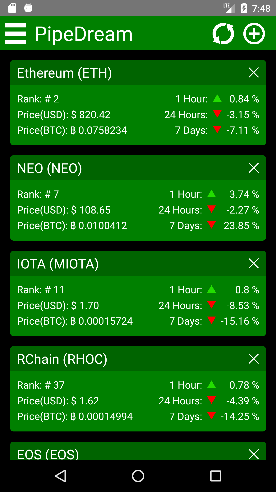
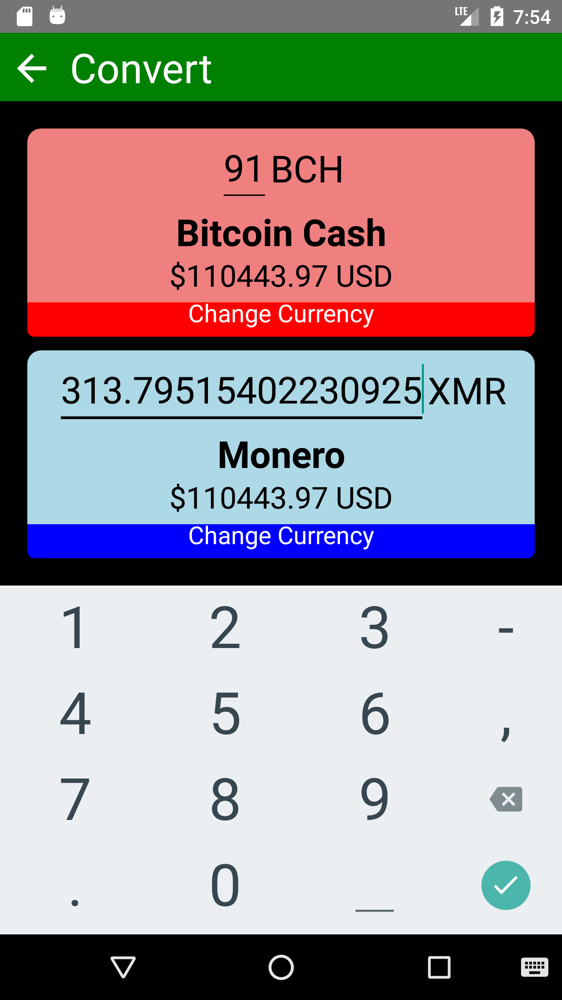
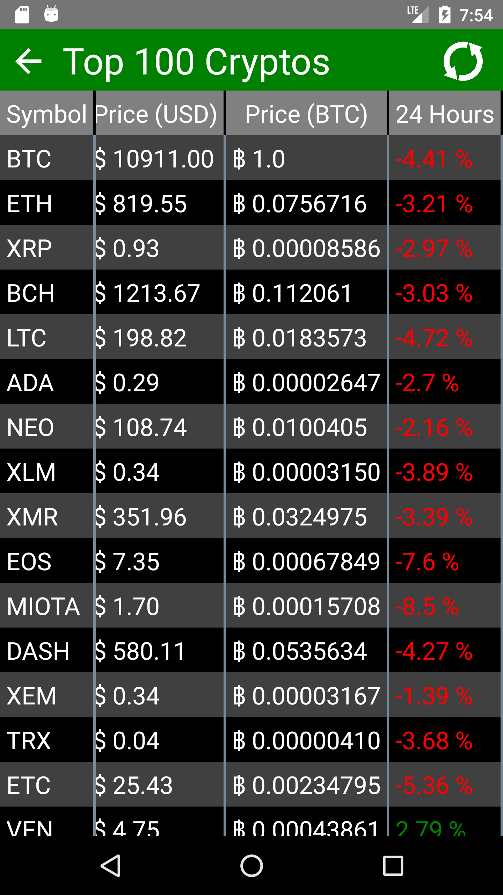
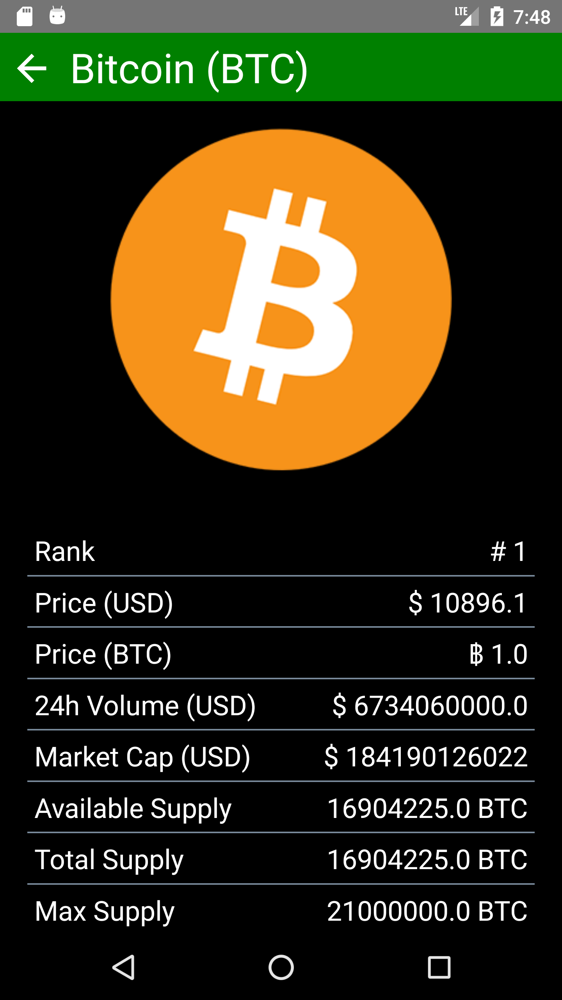
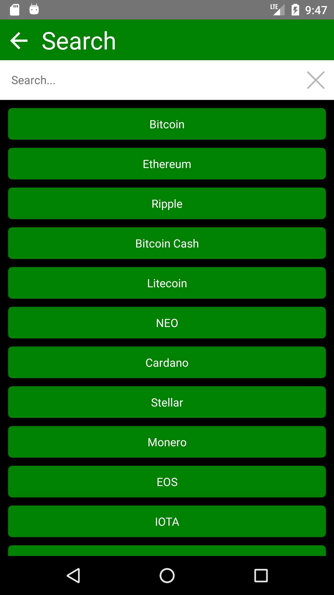

# Pipedream Crypto Price Checker
The purpose of this app was to provide an easy and quick way to check the prices of your favourite crypto currencies. This app was built in React Native and leverages [Coin Market Cap's](https://coinmarketcap.com/api/) API to gather data for each coin as well as [Chasing Coin's](https://chasing-coins.com/api) API to gather the logos for each coin. A kanban board was utilised to track changes and features. This board can be found in the project section of this github repo. 

Two external React Native libraries were used in this project. The first, [React Native Drawer](https://github.com/root-two/react-native-drawer), was used to create the slack style drawer. The second library utilised was [React Navigation](https://reactnavigation.org/) for the navigation of pages. The React Native Drawer drawer was used in favor of the built in React Navigation drawer due to the customisability of React Native Drawer's drawer. The name Pipedream comes from the fact that many crypto investors are solely in it for the money rather than the technology. This in turn is a sort of pipedream for them so as kind've a poke at that I named this app Pipedream.

[This App Can Now Be Found on the Google Play Store]()

## Main Card Screen
The first and main feature of Pipedream is the card view that a user can use to pin their favourite coins. The user can set these cards to update upon opening the app so as to have the quickest possible glance at their favourite coins. The user can also press on the titles of any of these pinned cards to access more in depth information about these coins.

	

## Quick Conversion
The quick conversion screen can be used to quickly compare various coins. It supports dual currency comparison with on the live conversions. This means that a user can select any two coins they want and start typing in coin values to quickly see how much one coin is worth in another coin. This can be utilised to quickly convert the price of a coin into a more familiar coin. This also displays this price in USD to allow the user to get a feel from a fiat currency perspective.

	

## Top 100
The Top 100 screen displays the current top 100 coins in a nice presentable grid format to allow a user to quickly analyse the market and analyse what the recent activity is like within this market. This can help investors to know what is happening within the market or any other of analytical ways. Upon pressing the always on screen first column the app will navigate to the in depth information screen for the respective currency.

	

## In Depth Information
The In Depth Information screen allows a user to look at the in depth information provided by the Coin Market Cap API. This is also where the API from Chasing Coins is leveraged to pull the logos of each coin. This allows users to analyse a coin and get a feel of it from their logo.

	

## Search
The Search page allows the user to search for any coin that is on Coin Market Cap. This includes upwards of 1500 coins. Upon pressing any of these coins the user is taken to the in depth information page for the respective coin.

	

